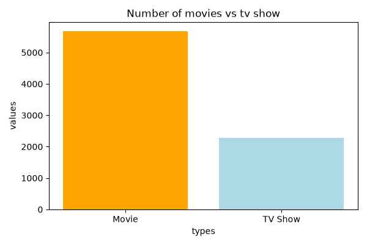
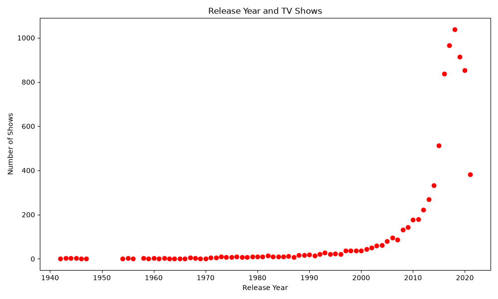
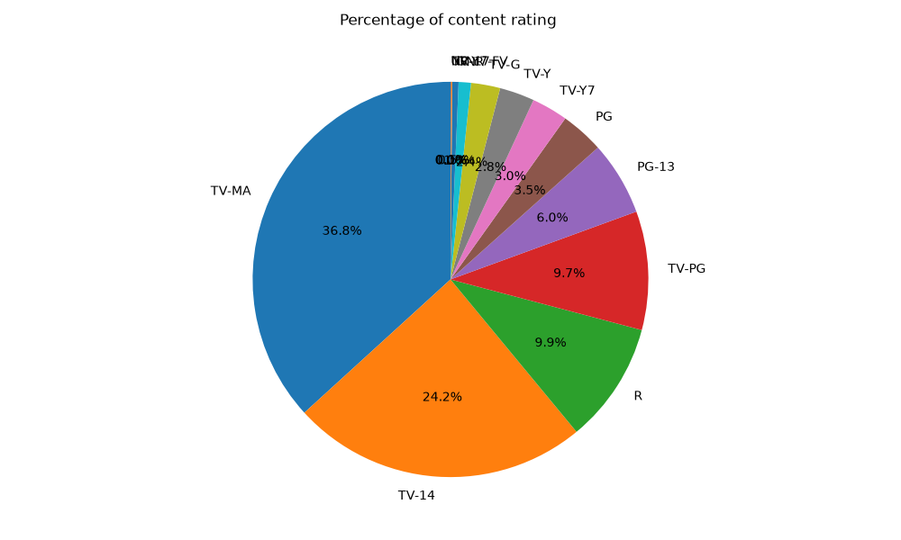
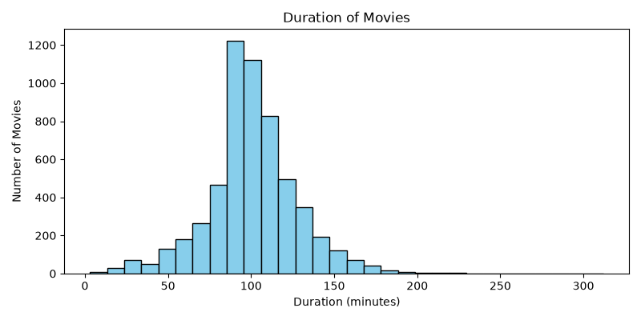

# 🎬 Netflix Data Visualization

> **Exploratory Data Analysis of Netflix Movies & TV Shows using Python, Pandas & Matplotlib**

<p align="center">
  
</p>

<p align="center">
  <strong>Cleaning → Exploring → Analyzing → Visualizing</strong>
</p>

---

## 📌 About the Project

This project explores a Netflix titles dataset to understand the composition and release patterns of movies and TV shows available on Netflix.

The project focuses on **practical data analysis and visualization**, starting with raw data and turning it into understandable charts and insights.

### 🎯 Main Goals

- Clean and prepare the raw Netflix dataset
- Identify and handle duplicate records
- Inspect and handle missing values
- Compare movies and TV shows
- Analyze release trends over time
- Explore content-rating distribution
- Analyze movie-duration patterns
- Build clear visualizations using Matplotlib

---

## 🧰 Tech Stack

| Tool | Purpose |
|---|---|
| 🐍 **Python** | Core programming |
| 🐼 **Pandas** | Data cleaning & analysis |
| 📊 **Matplotlib** | Data visualization |
| 💻 **VS Code / Jupyter** | Development environment |
| 🗃️ **CSV** | Dataset format |

---

## 🔄 Project Workflow

```text
Raw Netflix Dataset
        ↓
Data Inspection
        ↓
Data Cleaning
        ↓
Handle Missing Values
        ↓
Remove Duplicates
        ↓
Filtering & Transformation
        ↓
Exploratory Data Analysis
        ↓
Matplotlib Visualizations
        ↓
Insights
```

---

## 🧹 Data Cleaning

Before creating the visualizations, the dataset was inspected and prepared for analysis.

### Cleaning steps

- Checked dataset shape and columns
- Inspected missing values
- Removed duplicate records
- Examined data types
- Filtered relevant records
- Prepared release-year and content-type data
- Prepared movie-duration values for histogram analysis
- Grouped data for comparison and trend analysis

---

# 📊 Visualizations & Insights

## 1. 🎞️ Movies vs TV Shows

<p align="center">
  
</p>

### What the chart shows

The dataset contains **substantially more movies than TV shows**.

The comparison makes the difference between the two content types immediately visible and provides a useful starting point for understanding the dataset.

---

## 2. 📈 Movies & TV Shows Released Over the Years

<p align="center">
  
</p>

### What the chart shows

The release trends show a major increase in Netflix titles in the later years of the dataset.

- Movie releases rise strongly from the 2000s onward.
- Movie releases reach their highest level around the late 2010s.
- TV-show releases also accelerate strongly in the 2010s.
- TV-show releases peak around the late 2010s/early 2020s.
- The sharp growth suggests that Netflix's catalog expanded significantly during this period.

> **Important:** A release-year chart shows the year associated with the title in the dataset; it should not automatically be interpreted as the exact year Netflix added every title.

---

## 3. 🔞 Content Rating Distribution

<p align="center">
  
</p>

### Key observations

The largest categories in this dataset include:

| Rating | Approx. Share |
|---|---:|
| **TV-MA** | **36.8%** |
| **TV-14** | **24.2%** |
| **R** | **9.9%** |
| **TV-PG** | **9.7%** |
| **PG-13** | **6.0%** |

TV-MA and TV-14 together make up a large portion of the categorized content, showing that mature and teen-oriented ratings are prominent in this dataset.

---

## 4. ⏱️ Movie Duration Distribution

<p align="center">
  
</p>

### What the histogram shows

Most movie durations are concentrated around roughly **80–120 minutes**, with fewer movies appearing at very short or very long durations.

The distribution also has a noticeable long tail toward longer movies.

---

# 🔎 Questions Explored

This project was built around practical EDA questions such as:

1. How many movies and TV shows are in the dataset?
2. Which content type is more common?
3. How has the number of titles changed over the years?
4. Which years contain the highest number of movie releases?
5. Which years contain the highest number of TV-show releases?
6. What are the most common content ratings?
7. What percentage of titles belong to each rating category?
8. What is the typical duration range of movies?
9. How is movie duration distributed?
10. What patterns can be identified from the Netflix catalog?

---

# 📁 Project Structure

```text
Netflix_data_visualization/
│
├── 📄 Netflix_data_visualization.py
├── 📄 netflix_titles.csv
├── 📄 README.md
│
└── 📁 assets/
    ├── 🖼️ compare_of_movies_and_tvshows.png
    ├── 🖼️ Releasing_year_and_tvshow.png
    ├── 🖼️ content_rating.png
    └── 🖼️ duration_view_histogram_chart.png
```

> Update the Python and CSV filenames above if your actual repository uses different names.

---

# 🚀 How to Run

### 1. Clone the repository

```bash
git clone https://github.com/kiranaiml/Netflix_data_visualization.git
```

### 2. Open the project

```bash
cd Netflix_data_visualization
```

### 3. Install dependencies

```bash
pip install pandas matplotlib
```

### 4. Run the analysis

```bash
python Netflix_data_visualization.py
```

---

# 💡 Skills Demonstrated

### Python
- Variables and data structures
- Functions
- Basic data processing

### Pandas
- DataFrame operations
- Data inspection
- Filtering
- Missing-value handling
- Duplicate handling
- `groupby()`
- Aggregation
- Data transformation

### Matplotlib
- Bar charts
- Line charts
- Pie charts
- Histograms
- Figure sizing
- Titles and labels
- Axes
- Grids
- Basic chart customization

---

# 📈 Project Outcome

This project demonstrates the complete basic EDA workflow:

**Raw Data → Clean Data → Analysis → Visualization → Insights**

Rather than only creating charts, the project focuses on understanding what the data is saying and communicating those findings visually.

---

# 🔮 Possible Future Improvements

- Add genre analysis
- Add country-wise analysis
- Analyze directors and actors
- Compare movie vs TV-show ratings
- Create an interactive dashboard using **Plotly** or **Streamlit**
- Add more advanced statistical analysis
- Improve chart design and annotation
- Add automated data-cleaning steps
- Build a small recommendation system from the dataset

---

# 👨‍💻 Author

### Kiran

**Aspiring AI/ML Engineer**

GitHub: **[@kiranaiml](https://github.com/kiranaiml)**

---

## ⭐ If you find this project useful

Feel free to explore the code, visualizations, and analysis.

**Built while learning Python → Pandas → Matplotlib → Data Analysis → AI/ML 🚀**
